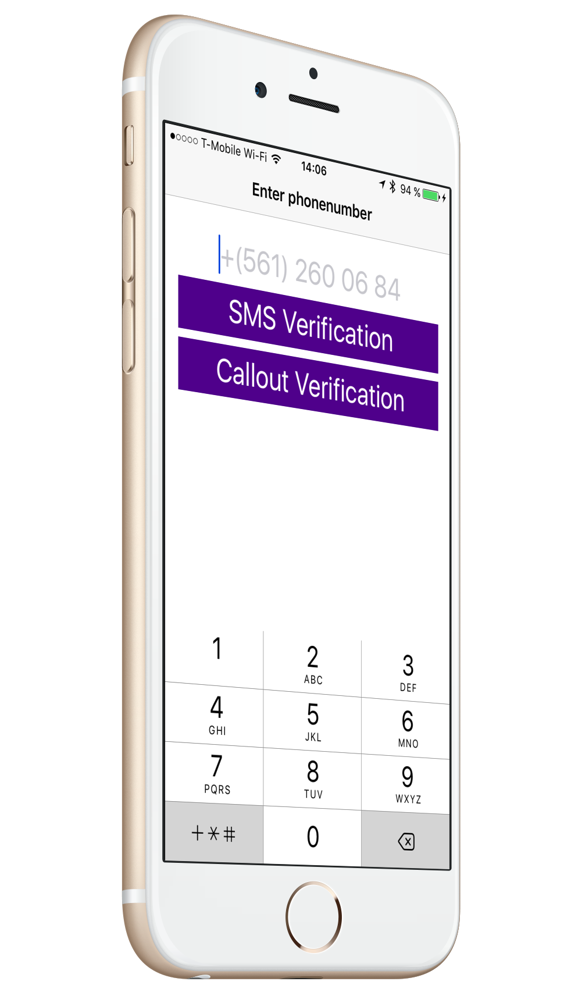
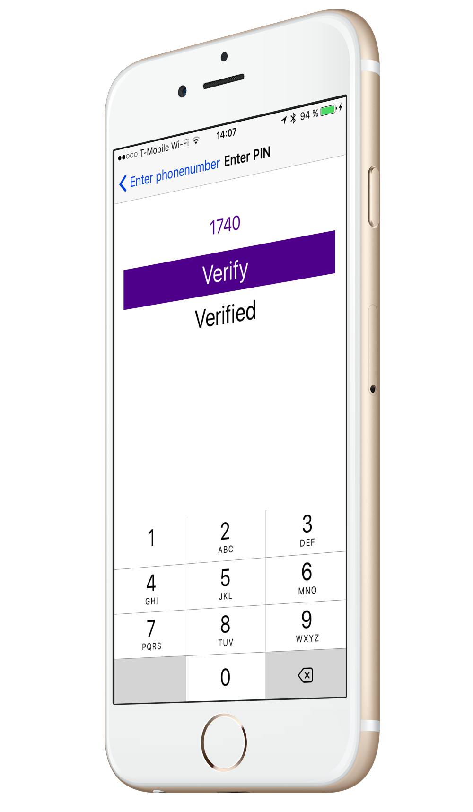
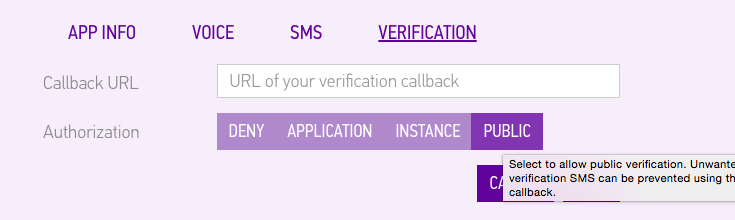

## Verifying a phone number on iOS using Swift 
In this tutorial you learn how to verify a users phone number using our Swift framework, we support two methods of verifying on iOS one is the classic SMS and the other is Callout verification where we place a call to the number and the user then presses 1 to confirm that they wanted the call.
<table border=0 style="border:0px;">
<tr>
<td>Start screen
</td>
<td></td>
</tr>
</table>
##Getting started
1. [Create an account](https://www.sinch.com/dashboard/#/signup)
2. Create an app and change enable verification (set it to public for now) 

3. Take note of the Application key 
4. Create a new Single view project 
5. Add cocoapods file and install pods
6. A physical device with SIM card

```text
platform :ios, '8.0'
use_frameworks! 
pod 'SinchVerification-Swift'
```

##Building the first screen UI
Open up your workspace and go to **main.storyboard** file, open up assistant view so also see **ViewController.swift**

1. Add Textfield and and outlet called **phoneNumber**, set the keyboard type of the field to phone number. 
2. Add a SMS Verification button and create an action called **smsVerification** 
3. Add a Callout Verification button and create an action called **calloutVerification** 
4. Add a label and call and an outlet called **status**
5. Add a Activity Indicator and an outlet called spinner, check the box to hide when no animated.
6. Embed the controller in a navigation controller editor/embed in/Navigation Controller 

Add your constraints and the first screen is done. Next thing we are going to do is to add some code to do a callout verification, I want to start with this because the callout verification does not require any addiontal screens. 

##Callout verification
The verification flow for a callout is pretty neat, you just imitate a callout verification and when the callback comes to the client your are actually done. How does it work? Sinch will place a call to the given phone number and when the user picks up we prompt the user to press 1, if they do its a success but if they done its a fail (or if they don't pick up etc)
Open up **ViewController.swift** and add a import for SinchVerification

```swift
import SinchVerification;
```
In top of your class add two variables to hold the verification and one to hold the application key. 

```swift
var verification:Verification!;
var applicationKey = "your key";
```
Great, now we want to start a callout verification once the user clicks on the callout verification button. 

```swift
@IBAction fun calloutVerification(sender: AnyObject) {
    disableUI(true);
    verification = CalloutVerification(
    	applicationKey:applicationKey, 
    	phoneNumber: phoneNumber.text!);
    verification.initiate { (success:Bool, error:NSError?) -> Void in
        self.disableUI(false);
        self.status.text = (success ? "Verified" : error?.description);
    }
}
```
As you can see thats not a lot of code to make this roll, you might notice that I have  disbleUI call in here, thats a small method to disable the ui while waiting for the call. This is important to do because if the user starts multiple verification requests they might get stuck in a loop where they never get verified and the phone just keeps ringing. I implemented a timeout for 30 seconds before I consider it to be a fail and the user can retry. 

```swift
fun disableUI(disable: Bool){
    var alpha:CGFloat = 1.0; // if enabled alpha is 1
    if (disable) {
        alpha = 0.5; add alpha to get disabled look
        phoneNumber.resignFirstResponder(); 
        spinner.startAnimating(); 
        self.status.text="";
        // enable the ui after 30 seconds if no success or fail has been recieved in the
        //verification sdk
        let delayTime = dispatch_time(DISPATCH_TIME_NOW, Int64(30 * Double(NSEC_PER_SEC)))
        dispatch_after(delayTime, dispatch_get_main_queue(), { () -> Void in
            self.disableUI(false);
        });
    }
    else{
        self.phoneNumber.becomeFirstResponder();
        self.spinner.stopAnimating();
        
    }
    self.phoneNumber.enabled = !disable;
    self.smsButton.enabled = !disable;
    self.calloutButton.enabled = !disable;
    self.calloutButton.alpha = alpha;
    self.smsButton.alpha = alpha;
}
```
Let thing to get a little bit sweeter ui, add a viewWillAppear and set the phone number to first responder 

```swift
    override func viewWillAppear(animated: Bool) {
        phoneNumber.becomeFirstResponder();
        disableUI(false); // make sure ui is enabled,
    }
```
So nothing fancy as you can see :) Run the app and try it out. Pretty sweet right?

##Adding SMS verification
Another way of adding verification is the classic sms pin that I am sure you have seen. The downside of SMS in my opinion is that you need to enter a code. To accomplish a SMS verification you need a new view where you can enter code. Add a new ViewController to the solution and call in EnterCodeViewController.swift. Open up **Main.Storyboard** and add a view controller to the board and set the first responder to the newly created Controller
1. Add a textfield and an outlet called code 
2. Add a button and an action called verify. 
3. Add label and an outlet called status
4. Lastly a spinner and an outlet called spinner. 
5. Add a segue from ViewController.swift to EnterCodeViewController.swift and call it **enterPin**.

Add your constraints and make it look like you want, but it should look something like this
. 

### Initiating an SMS verification
Initiating an SMS verification is very similar to Callout, the big difference here is when you get the success callback, it doesn't mean its verified, it just means that we have sent an sms. What we need to do after that is to send in a code that we get from user input to verify the code. In this case we do that in a separate view controller. So once we have the success we perform the segue to show the entertain controller.   

```swift
@IBAction fund smsVerification(sender: AnyObject) {
	self.disableUI(true);
	verification = 
		SMSVerification(applicationKey:applicationKey, 
			phoneNumber: phoneNumber.text!)
	verification.initiate { (success:Bool, error:NSError?) -> Void in
	    self.disableUI(false);
	    if (success){
	        self.performSegueWithIdentifier("enterPin", sender: sender);
	    } else {
	        self.status.text = error?.description;
	    }
	}
}
```
To verify a verification you need to keep the current verification object, so in in **prepareForSegue** we want to pass on the current verification object so we can call verify on it. 

```swift
override fun prepareForSegue(segue: UIStoryboardSegue, sender: AnyObject!) {
    if (segue.identifier == "enterPin") {
        let enterCodeVC = segue.destinationViewController as! EnterCodeViewController;
        enterCodeVC.verification = self.verification;
    }
    
}
```

Now thats out of the way, open up **EnterCodeViewController.swift** and go to the action verify and set up the ui for making a verification request and call verify on you verification object. 

```swift
@IBAction fund verify(sender: AnyObject) {
	spinner.startAnimating();
	verifyButton.enabled = false;
	status.text  = "";
	pinCode.enabled = false;
	verification.verify(pinCode.text!, 
		completion: { (success:Bool, error:NSError?) -> Void in
	   		self.spinner.stopAnimating();
	    	self.verifyButton.enabled = true;
	    	self.pinCode.enabled = true;
	    if (success) {
	        self.status.text = "Verified";
	    } else {
	        self.status.text = error?.description;
	    }
	});
}
```

You now have a verified number for you user. With this implementation you only know on the client side that the number is verified. In a real world app you would need to tell your backend that the number is verified. You could accomplish that in two ways. Either calling that update on the success flow from the client. Or your our callbacks that we have for verification (recommended) [https://www.sinch.com/docs/verification/rest#verificationcallbackapi]()


 